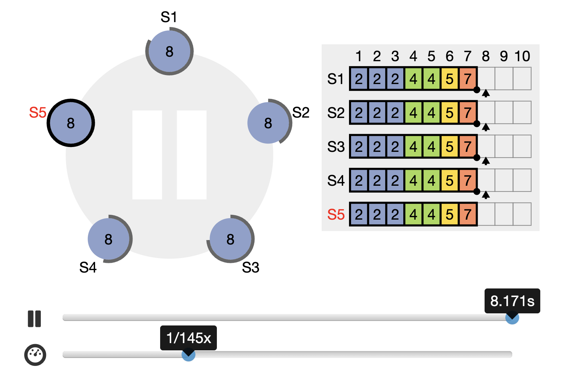
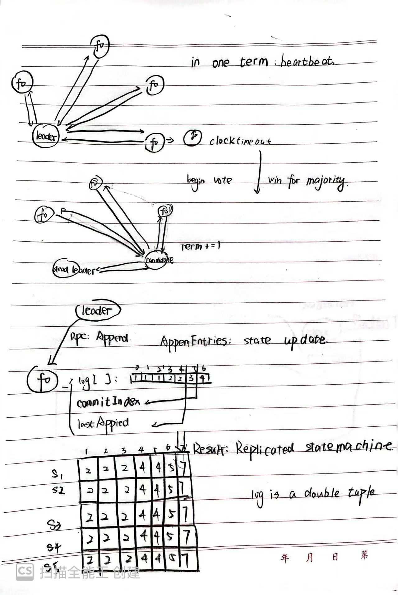
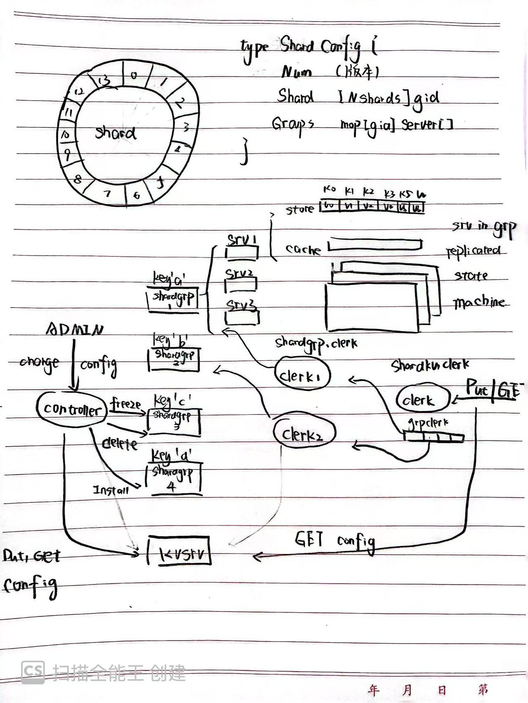

# MIT 6.5840
A shard KV server based on Raft consensus Algorithm
## What is distribute system and why we need it
a group of computers cooperating to provide a service

for example:
    popular apps' back-ends, e.g. for messaging
    big web sites

storage
transaction systems
"big data" processing frameworks
**Blockchain**
### goal
hide the complexity of distribution from applications, 

for example our Shard KV server client only supply PUT/GET api, most of the code is for consensus and concurrency

## the principle of distribute system
- Consistency 一致性
- Availability 可用性
- Partition Tolerance 分区容错性
## Build a intuition about raft

- a set of servers, each server has a replicated state machine, work together to maintain a linear state change!

- a gossip network, just like Bittorrence and blockchain

